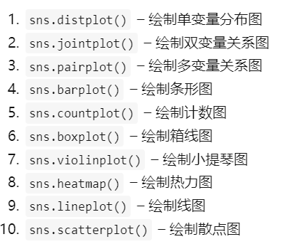

# 代码网页
[shear.html](../assets/shear_1695300955985_0.html)
- # 1.数据分析
	- ## 1.1数据分布
		- ### 导入数据。
		  collapsed:: true
		  data数据由excel输入，再筛选去除有箍筋数据；去掉两个变量；剔除怪异数据。
		  data_4show数据同样经由excel输入，筛选去除有箍筋数据。
			- 1. 对data_4show进行展现
			- 2. describe()函数就是返回数据结构的统计变量。其目的在于观察这一系列数据的范围、大小、波动趋势等等，为后面的模型选择打下基础。
			     count：数量统计，此列共有多少有效值
			     unipue：不同的值有多少个
			     std：标准差
			     min：最小值
			     25%：四分之一分位数
			     50%：二分之一分位数
			     75%：四分之三分位数
			     max：最大值
			     mean：均值
			- 3. 绘制表格的直方图（list函数），并用figsize规定图像的尺寸大小
			- 4. seaborn用于统计数据的可视化
			  {:height 128, :width 247}
			-
		- ### 对data数据绘制多变量关系（不包括横筋）
		- ### 对data中的目标-抗剪强度做多变量展现，其余变量合并展现，对纵筋的两变量单独放大展现。
	- ## 1.2 相关性分析
		- 数据相关性分析中常用到data.corr()函数，data.corr()表示了data中的两个变量之间的相关性，取值范围为[-1,1],取值接近-1，表示反相关，类似反比例函数，取值接近1，表正相关。
		  对所有数据取相关性后再单独查看抗剪强度相关性
- # 2.准备数据集
	- ## 2.1 标准化(Standardization)
		- loc：通过行、列的名称或标签来索引；iloc：通过行、列的索引位置来寻找数据
		- skleran中为我们提供了一个数据预处理的package：preprocessing对数据进行标准化
		  [sklearn中StandardScaler.fit() 、StandardScaler.transform() 、StandardScaler.fit_transform()的用法_standardscaler().fit_方程式sunny的博客-CSDN博客](https://blog.csdn.net/weixin_45589116/article/details/123921246)
		- 对于Dataframe的构建讲解；在此输出X的标准化值列表切片
		  [Pandas 数据结构 – DataFrame | 菜鸟教程 (runoob.com)](https://www.runoob.com/pandas/pandas-dataframe.html)
	- ## 2.2 划分训练集和测试集
		- [python机器学习 train_test_split()函数用法解析及示例 划分训练集和测试集 以鸢尾数据为例 入门级讲解_侯小啾的博客-CSDN博客](https://blog.csdn.net/weixin_48964486/article/details/122866347)
- # 3.模型
	- ## 3.1 采用线性回归模型
	  model = LinearRegression()
	  [机器学习| 算法笔记-线性回归（Linear Regression） - 知乎 (zhihu.com)](https://zhuanlan.zhihu.com/p/139445419?utm_id=0)
	  机器学习的目标是最小化损失函数，由此引出梯度下降法求最小值。
	  [梯度的方向为什么是函数值增加最快的方向？ - 知乎 (zhihu.com)](https://zhuanlan.zhihu.com/p/38525412)
	  [Gradient-Descent（全世界最通俗易懂的梯度下降法详解-优化函数大法） - 知乎 (zhihu.com)](https://zhuanlan.zhihu.com/p/261375491)
	- ## 3.2 采用全连接神经网络，多层感知机(Fully connected neural network, OR, Multi-layer Perceptron regressor）
	  [深度学习开端｜全连接神经网络 - 知乎 (zhihu.com)](https://zhuanlan.zhihu.com/p/104576756?utm_id=0)
	  全连接神经网络就是对特征进行不断处理求解，输出结果，同时反向通过损失函数不断逼近最终参数。
	  [sklearn.neural_network.MLPRegressor-scikit-learn中文社区](https://scikit-learn.org.cn/view/714.html)
	- ## 3.3随机森林模型
	  [随机森林算法参数解释及调优 - 知乎 (zhihu.com)](https://zhuanlan.zhihu.com/p/56940098)
	  [一文看懂随机森林 - Random Forest（4个实现步骤+10个优缺点） (easyai.tech)](https://easyai.tech/ai-definition/random-forest/)
-