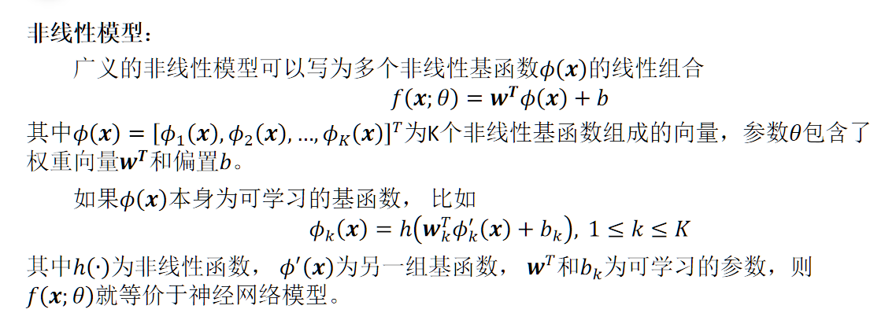
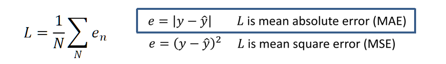

- 机器学习（Machine Learning， ML）就是让计算机从数据中进行自动学习， 得到某种知识（或规律）。通俗地讲，机器学习就是寻找函数。
  background-color:: red
- ## 基本概念
  id:: e1dd8ba8-fa97-424d-a442-4e4c0ac391b6
	- ### 样本——数据集
	  每一组之中的特征向量与标签共同组成了一个样本。而样本的集合叫做数据集，其分三类：一为训练集，用于训练；二为验证集，用于调整模型达到良好表现；三为测试集，用于验证最终模型好坏。
		- #### 特征——特征向量
		  一个问题，是由给出的变量以及实现目标组成。工程而言就是物质的属性，如高，宽，剪跨比，配筋率等，这些部分称之为特征。采用一个向量组表示所有特征的集合，每一维就代表一个特征。
		- #### 标签
		  即上述的目标值。
	- ### 过拟合
	  根据大数定理可知，当训练集大小趋向于无穷大时，经验风险就趋向于期望风险．然而通常情况下，我们无法获取无限的训练样本，并且训练样本往往是真实数据的一个很小的子集或者包含一定的噪声数据， **不能很好地反映全部数据的真实分布**。经验风险最小化原则很**容易导致模型在训练集上错误率很低， 但是在未知数据上错误率很高。**这就是所谓的过拟合（Overfitting）。
	  **应对过拟合：**1.减少模型复杂度；2.正则项；3.增加训练集
	- ### 浅层学习
	  传统的机器学习主要关注如何学习一个预测模型。 一般需要首先将数据表示为一组特征（Feature）， 特征的表示形式可以是连续的数值、 离散的符号或其他形式． 然后将这些特征输入到预测模型， 并输出预测结果。 这类机器学习可以看作浅层学习（Shallow Learning）。浅层学习的一个重要特点是**不涉及特征学习， 其特征主要靠人工经验或特征转换方法来抽取。**
	- ### [[深度学习]]
	  collapsed:: true
	  为了学习一种好的表示， 需要构建具有一定 “深度” 的模型， 并通过学习算法来让模型自动学习出好的特征表示（从底层特征， 到中层特征， 再到高层特征） ，从而最终提升预测模型的准确率。
	  这样我们就需要一种学习方法可以从数据中学习一个“深度模型”，这就是深度学习（Deep Learning， DL）。深度学习是机器学习的一个子问题，其**主要目的是从数据中自动学习到有效的特征表示。**
	  深度学习目前主要采用神经网络，但神经网络和深度学习并不等价。深度学习可以采用神经网络模型，也可以采用其他模型（比如深度信念网络是一种概率图模型）。
		- 神经网络
- ## 基本要素
  id:: 01b28435-ebfe-4735-b05d-ecefb649351b
  collapsed:: true
	- ### 模型
	  输入空间和输出空间构成样本空间。假设x和y之间的关系可以通过一个未知的真实映射函数y=g(x)来描述，机器学习的**目标是找到一个模型来近似真实映射函数g(x)。**
	  由于我们不知道真实的映射函数g(x)，因此只能**根据经验来假设一个函数集合F**，称为假设空间（hypothesis space），然后通过**观察其在训练集和测试集上的表现**，从中选择一个最理想的函数f^∗∈F。
	  **F={f(x;θ)|θ∈ℝ^D}**
	  其中f(x;θ)是参数为θ的函数，即模型（model），D为参数的数量。此时的模型尚未确定，我们通过对参数θ的调试找出最优函数。
		- #### 模型目标
			- **1.求解样本特征向量x和标签y之间存在的未知函数关系y=h(x)**
			  给定训练集D， 我们希望让计算机从一个函数集合中自动寻找一个 “最优” 的函数f^∗(x)来**近似**每个样本的特征向量x和标签y之间的真实映射关系。如何寻找最优的函数（模型） f^∗=(x)是机器学习的关键，一般需要**通过优化算法对损失函数（目标函数）进行优化**来完成。这个优化过程通常称为学习或训练（training）。
			- 2.求解样本随机变量x与标签随机变量之间存在的未知条件概率分布p(y|x)
		- #### 建立模型
			- #### 线性模型
			  线性模型的假设空间为一个**参数化的线性函数族**，即：
			  **f(x;θ)=w^Tx+b**
			  其中参数θ的包含了权重向量w^T和偏置b。
			- #### 非线性模型
			  {:height 210, :width 564}
			  其与线性模型有类似点，但是x变为基函数，代表了非线性特征需处理后的才变为线性组合。再次对ϕ(x)研究，如果能继续建立非线性模型套娃学习，那么就形成了神经网络的结构。
	- ### 损失函数（学习准则）
	  损失函数（loss function）是一个非负实数函数，用来衡量模型优劣程度，有时也称objective function或cost function。也就是说，该模型的预测结果有多坏。
	  {:height 98, :width 642}
	- ### 优化算法
	  在确定了**训练集、假设空间** 以及**学习准则**后，如何找到最优的模型就成了一个最优化（Optimization）问题。机器学习的训练过程其实就是**最优化问题的求解过程**。
		- #### 参数优化
		  模型f(x;θ)中的θ称为模型的参数，可以通过优化算法进行学习。
		- #### 超参数优化
		  除了可学习的参数θ之外， 还有一类参数是用来定义模型结构或优化策略的，这类参数叫作超参数（Hyper-Parameter）。
		  常见的超参数包括：聚类算法中的类别个数、梯度下降法中的步长、正则化项的系数、神经网络的层数、支持向量机中的核函数等。超参数的选取**一般都是组合优化问题，很难通过优化算法来自动学习。**因此，超参数优化是机器学习的一个经验性很强的技术，**通常是按照人的经验设定，或者通过搜索的方法对一组超参数组合进行不断试错调整**。
- ## 卷积神经网络
  id:: 54f43770-5dc9-4550-9ebc-949e1c2691c2
	- 人工智能的深度学习和机器学习算法、计算机视觉、无人机、3D 打印、BIM、虚拟现实和增强现实等应用于土木工程，将形成无人化、全自动、智慧化、实景体验的城市和区域规划、以及土木工程设计、建造、养维护和灾害管控的新技术。
		- 智能设计
		- 智能规划
		- 智能建造
			- 3D打印
			- BIM
		- 智能养维护
			- 损伤检测
			-
		-
		-