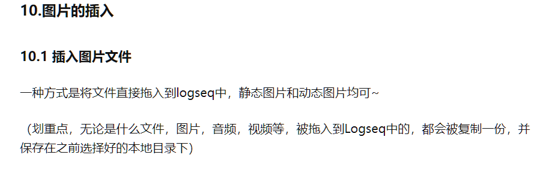
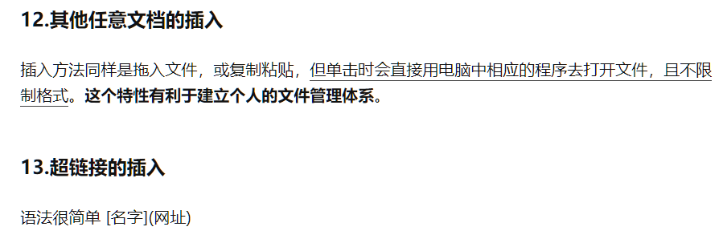

## 图谱：
id:: 650557f9-0478-44be-8ace-f57a88099bae
即文件夹，可以有多个文件夹或者一个文件夹放下要记录的东西，软件一次展示一个图谱的东西，可以切换不同的图谱来进行大的分类切换，就像是两本不同的笔记本一样
-
- ## 块：
  id:: d491a634-5225-438b-b9e3-615fa8dc15a2
  即小黑点与之后的内容。回车新建块，shift+回车在块内换行。块之中可以嵌套块，使用tab键进入嵌套块，【tab】缩进，【shift+tab】  提升级别，再次使用tab再次缩进，就像是升级与降级一样确定每个块的从属关系
	- ### 块的引用：
	  id:: c7924067-f145-4dd0-8590-1bd9b05c89ef
	  复制块引用——粘贴地址后回车——这种方法只显示连续的第一段话内容
		- 引用示例： ((650557f9-0478-44be-8ace-f57a88099bae))
	- ### 块的完整引用：
	  id:: 50fa1c77-b977-48bc-925f-1c42a7aa50e1
	  内嵌块——粘贴——回车——显示完整的引用块在一个框中，并产生了一个双链。如下：
	  {{embed ((650557f9-0478-44be-8ace-f57a88099bae))}}
-
- ## 目录与新建文件
  id:: ba121874-7eaf-47c3-9480-3116bc4eebf4
	- ### 简介及创建
		- 目录完全依靠自己创建，它是对于自己笔记的框架整理，写的每一页拥有一个索引，也就是“[[xxx]]”,这就是新建文件。就像是书里一张纸的页码，汇总在目录中，文件内点开是内容，文件名就是索引。
		- **块的引用，纯文本，页面索引，共同完成一个完整目录的构建**。
		- 记录时可以插入emoji表情，它有助于提升笔记可读性以及增加活力🙂，【win+。】键调出。
	- ### 名称修改
		- 页面名称的修改**不可在其链接名称处进行**，而应当进入页面之中进行修改
		- 块的标题不满意需要进行重命名，应当在其地址双圆括号去掉一队变为单圆括号，然后前面加上“【标题】”即可
	- ### 对于图片的插入方式
	  background-color:: purple
	  {:height 239, :width 748}
	- ### 对于文件以及超链接的插入方式
	  background-color:: blue
	  
-